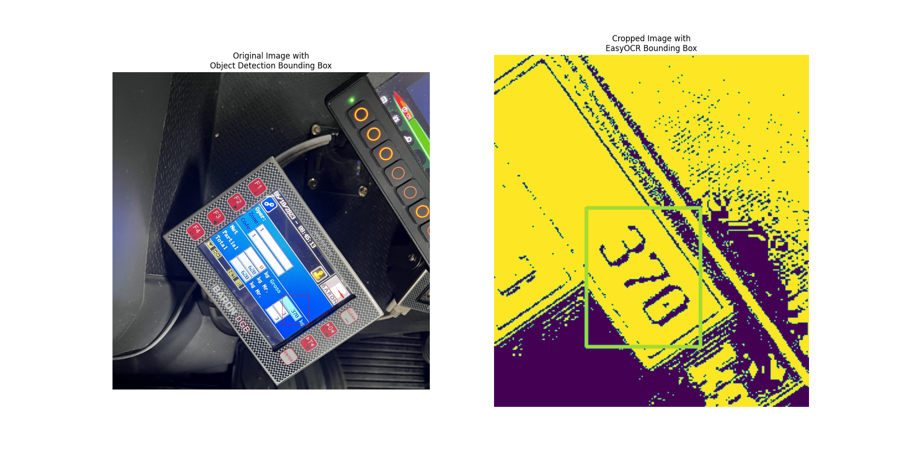

# README

## General Information
This directory holds all files that are related to training, building and applying OCR models. Within this directory, you will be able to find attempts at building Objection Detection/OCR Models using `pytesseract`, `tensorflow`, `pytorch` and `easyocr`. The final model that has been selected for deployment in the flask application is `pytorch`. 

### PyTesseract Information
For `pytesseract`, the method employed here is to directly apply the OCR model onto the input dataset. We have found that the accuracy is very low without proper object detection assisting in locating the area that we wish to OCR.

### Tensorflow + EasyOCR Information
...

### PyTorch + EasyOCR Information
The model utilises a pretrained Faster RCNN Pytorch model to train a new Faster RCNN model on object detection for the area that is required to OCR. The model was trained through 20 epochs and selected based on least loss value. It is then fed into EasyOCR after image enhancement through Histogram Equalisation. EasyOCR is set to only recognise digits. Accuracy is much higher after object detection, but further image enhancement can be done to improve the accuracy.

*Example of PyTorch + EasyOCR*

### Related Files
1. `./pytorch_ocr_model`: Folder containing all things related to `pytorch` OCR Model
    1. `./pytorch_ocr_model/images`: Folder containing screenshots of OCR Model executing
    2. `./pytorch_ocr_model/pytorch_ocr_model_function.py`: Python script that consists of a function that takes in an image and outputs the recognised digits
    2. `./pytorch_ocr_model/pytorch_ocr_model_training.py`: Python script that trains or retrains an object detection model (Faster RCNN)
    3. `./pytorch_ocr_model/testing_data`: CSV file used as test dataset as part of model training
    4. `./pytorch_ocr_model/testing_prediction`: CSV file that stores output of model when fed the test dataset as part of model training
    5. `./pytorch_ocr_model/training_data`: CSV file used as train dataset as part of model training
    **__- `./pytorch_ocr_model/best_retrained_object_detection_model.pth`: to Prof and TAs, please download this file from Teams and upload to the directory as listed for `./pytorch_ocr_model/pytorch_ocr_model_training.py` to execute successfully __**
2. `./image_labelling.ipynb`:
3. `./model_evaluator.py`: Python script that iterates through entire image dataset and checks if the model recognises and outputs the correct digits
4. `./pytorch_evaluation_results.xlsx`: (Output of `model_evaluator.py`) Excel Workbook containing results of evaluation of `pytorch` + `easyocr` Model
5. `./tensorflow-ocr-model.py`:
6. `./tesseract_evaluation_results.xlsx`: (Output of `model_evaluator.py`) Excel Workbook containing results of evaluation of `pytesseract` OCR Model
7. `./tesseract_ocr_model.py`: Python script that consists of a function that takes in an image and outputs the recognised digits